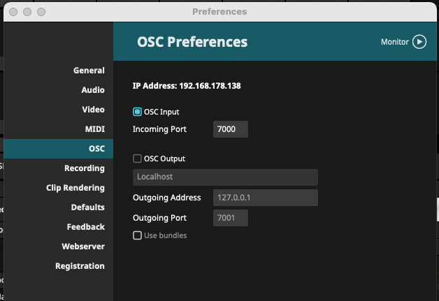
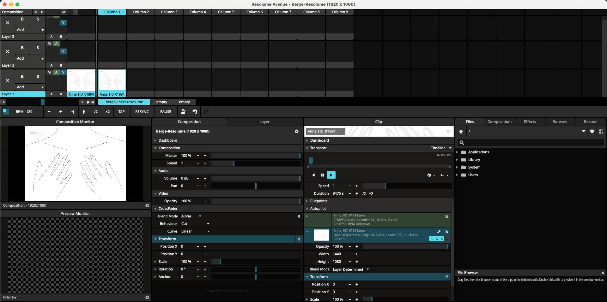
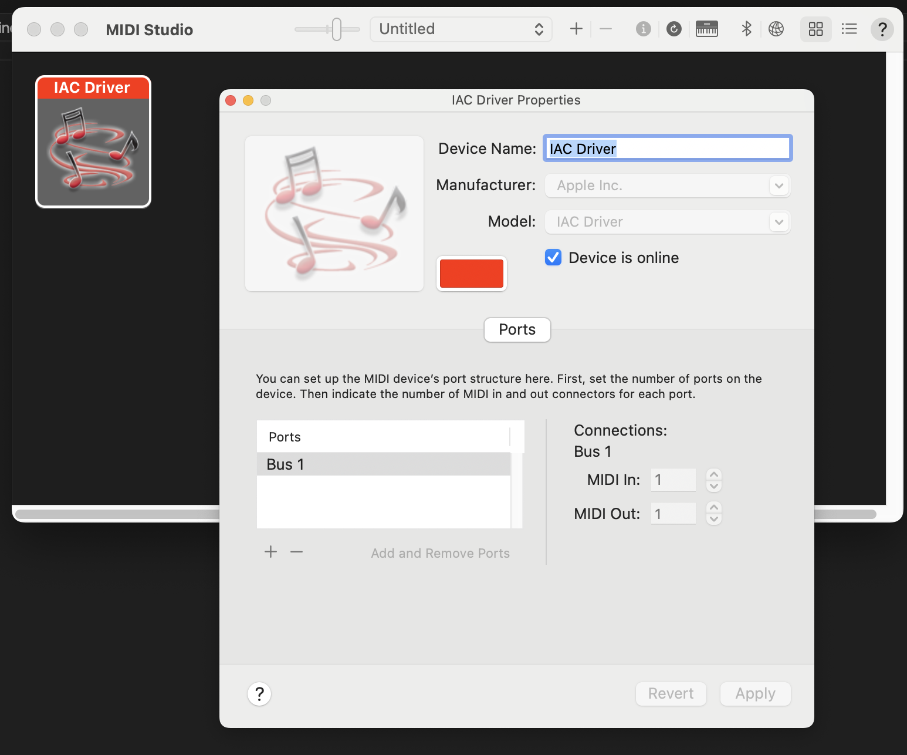

# Run precompiled App

Download & Install Resolume Avenue
https://www.resolume.com/download/

# Create new Resolume project

## activate OSC Input 
Resolume -> Einstellungen -> OSC
Input aktivieren und Port auf 7000

## Add video to Resolume Timeline

## set up Midi Input
### Mac

MIDI Studio öffnen

IAC Driver einrichten und aktivieren

## Start Application
chose MacOs or Windows

open Folder, execute bergekinectResolume

# Build using Processing

## Processing Libraries kopieren
Download libraries.zip
https://github.com/kjellxvx/berge-animation/blob/main/libraries.zip

Unpack libraries.zip
Paste content of libarbies in folder:

./Documents/Processing/libraries

## set up Midi Input
### Mac
~~Download CoreMidi4J~~
~~https://github.com/DerekCook/CoreMidi4J/releases~~
~~copy .jar file in Processing/libaries/themidibus/library~~

### Make java work on Mac
Applications -> Processing -> show packages
Contents -> Java
Copy jna-platform.jar and jna.jar from Java to /core/library

  

Paste file in:

Documents -> Processing -> libraries -> themidibus -> library
